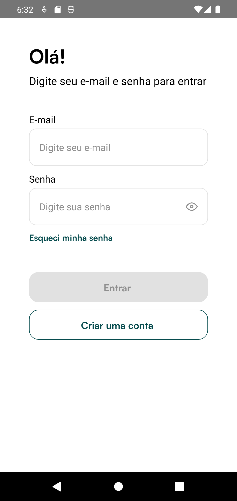
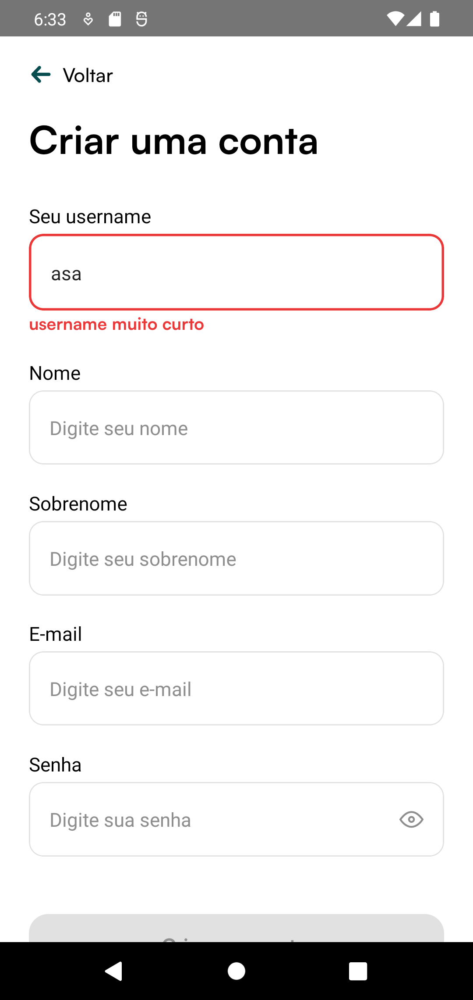
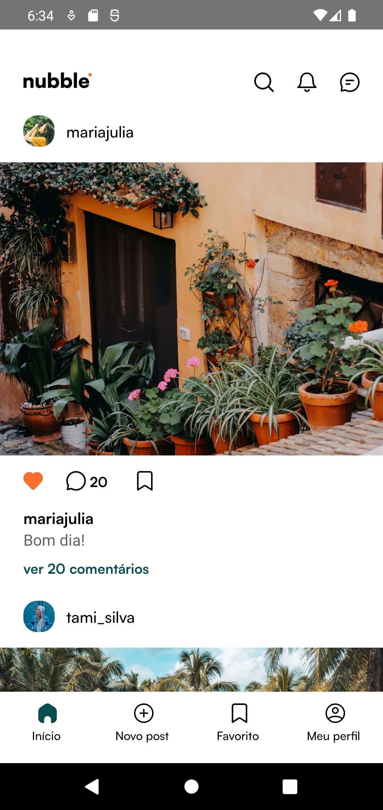
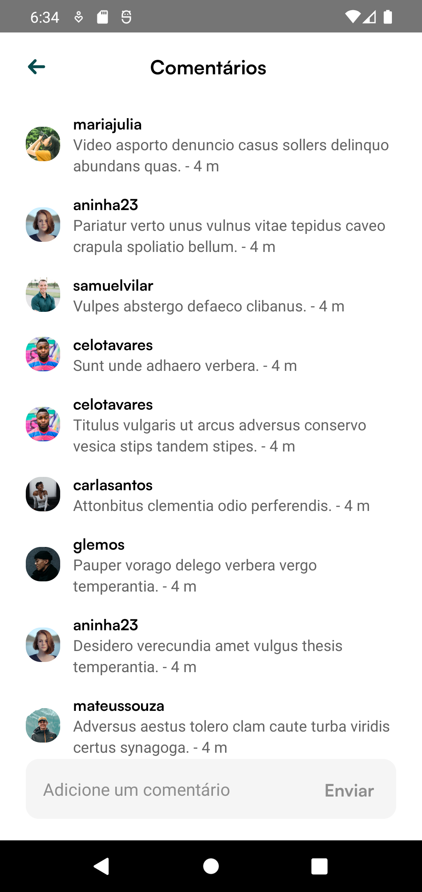

# Nubble App

Nubble App é um projeto criado no curso da Coffstack que consiste em aplicativo de rede social desenvolvido com React Native, TypeScript, React Native CLI e @shopify/restyle. O objetivo é fornecer aos usuários uma plataforma envolvente para conectar e compartilhar suas experiências por meio de uma interface de usuário familiar e intuitiva.

## Funcionalidades

O Nubble App oferece as seguintes funcionalidades:

1. **Autenticação do Usuário**: Os usuários podem criar uma conta, fazer login e sair com segurança. Isso garante que apenas usuários autorizados possam acessar as funcionalidades do aplicativo.

2. **Personalização de perfil**: Os usuários podem personalizar seus perfis adicionando uma foto de perfil, biografia e outros detalhes relevantes. Este recurso permite que os usuários expressem sua identidade e interesses.

3. **Feed de notícias**: O aplicativo fornece um feed de notícias onde os usuários podem descobrir e navegar pelas postagens compartilhadas por outros usuários. O feed de notícias mantém os usuários atualizados com as atividades mais recentes das pessoas que eles seguem.

## App Screenshots

## Tecnologias

O aplicativo utiliza as seguintes tecnologias:

- React Native
- React Native CLI
- Typescript
- @shopify/restyle
- Async-storage
- Zustand
- React Query
- zod
- React Hook Form
- Axios

## Contato

Entre em contato comigo através do linkedin clicando no botão abaixo:
 

